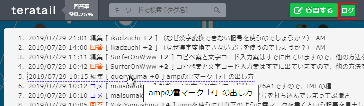

- [Teratail Logs Plus](#teratail-logs-plus)
  - [スクリーンショット](#%e3%82%b9%e3%82%af%e3%83%aa%e3%83%bc%e3%83%b3%e3%82%b7%e3%83%a7%e3%83%83%e3%83%88)
  - [機能](#%e6%a9%9f%e8%83%bd)
    - [質問ページの機能](#%e8%b3%aa%e5%95%8f%e3%83%9a%e3%83%bc%e3%82%b8%e3%81%ae%e6%a9%9f%e8%83%bd)
    - [tagsページの機能](#tags%e3%83%9a%e3%83%bc%e3%82%b8%e3%81%ae%e6%a9%9f%e8%83%bd)
  - [動作環境](#%e5%8b%95%e4%bd%9c%e7%92%b0%e5%a2%83)
  - [インストール](#%e3%82%a4%e3%83%b3%e3%82%b9%e3%83%88%e3%83%bc%e3%83%ab)
  - [使い方](#%e4%bd%bf%e3%81%84%e6%96%b9)
    - [質問ページの使い方](#%e8%b3%aa%e5%95%8f%e3%83%9a%e3%83%bc%e3%82%b8%e3%81%ae%e4%bd%bf%e3%81%84%e6%96%b9)
    - [tagsページの使い方](#tags%e3%83%9a%e3%83%bc%e3%82%b8%e3%81%ae%e4%bd%bf%e3%81%84%e6%96%b9)
  - [ライセンス](#%e3%83%a9%e3%82%a4%e3%82%bb%e3%83%b3%e3%82%b9)
- [Teratail Hide Feeds](#teratail-hide-feeds)
  - [動作環境](#%e5%8b%95%e4%bd%9c%e7%92%b0%e5%a2%83-1)
  - [インストール](#%e3%82%a4%e3%83%b3%e3%82%b9%e3%83%88%e3%83%bc%e3%83%ab-1)
  - [使い方](#%e4%bd%bf%e3%81%84%e6%96%b9-1)
  - [ライセンス](#%e3%83%a9%e3%82%a4%e3%82%bb%e3%83%b3%e3%82%b9-1)

# Teratail Logs Plus

[teratail](https://teratail.com/)にログ閲覧などを追加するユーザースクリプトです。

## スクリーンショット

質問ページのスクリーンショットです。

## 機能

### 質問ページの機能

- ログの一覧表示とログの場所への移動（更新日時の新しい順に表示）
- 質問を投稿後１時間以内のとき警告
- 質問者のスコアが0以下のとき警告
- 質問の評価が0未満のとき警告

### tagsページの機能

- 一度開いたことのある質問に着色
- 評価0未満の質問に着色
- クリップ1以上の質問に着色
- PV80以上の質問に着色
- 回答0の質問に着色

## 動作環境

- Google Chrome
- Firefox

## インストール

1. 拡張機能Tampermonkeyをインストール

- [Google Chrome の Tampermonkey](https://chrome.google.com/webstore/detail/tampermonkey/dhdgffkkebhmkfjojejmpbldmpobfkfo)
- [Firefox の Tampermonkey](https://addons.mozilla.org/ja/firefox/addon/tampermonkey/)

2. ユーザースクリプトの[Teratail_Logs_Plus.user.js](https://github.com/querykuma/Teratail_Logs_Plus/raw/master/Teratail_Logs_Plus.user.js)をTampermonkeyにインストール

## 使い方

teratailのURLを開きます。

質問のページとtagsページの２つがあります。

### 質問ページの使い方

ヘッダー上の**ログ**をクリックします。

ポップアップが出てログを表示します。

行をクリックするとログの場所に移動します。

ヘッダー上の**ログ**を再度クリックすることでもポップアップを閉じられます。

### tagsページの使い方

色を付けて見やすくしているだけです。

ユーザースクリプトによって追加される操作はありません。

## ライセンス

このソフトウェアはMITライセンスのもとで配布されています。

# Teratail Hide Feeds

teratailのtagsページでタグやタイトルで指定した質問（フィード）を非表示にするユーザースクリプトです。

## 動作環境

- Google Chrome
- Firefox

## インストール

1. 拡張機能Tampermonkeyをインストール

- [Google Chrome の Tampermonkey](https://chrome.google.com/webstore/detail/tampermonkey/dhdgffkkebhmkfjojejmpbldmpobfkfo)
- [Firefox の Tampermonkey](https://addons.mozilla.org/ja/firefox/addon/tampermonkey/)

2. ユーザースクリプトの[Teratail_Hide_Feeds.user.js](https://github.com/querykuma/Teratail_Logs_Plus/raw/master/Teratail_Hide_Feeds.user.js)をTampermonkeyにインストール

## 使い方

1. Tampermonkey内でユーザースクリプト「Teratail Hide Feeds」を開き、フィードを非表示にしたいタグ名（変数HIDE_TAGS_RE）とフィードを非表示にしたいタイトル名（変数HIDE_TITLES_RE）を正規表現で編集します。
2. tagsページを開くと、1で設定したタグ名とタイトル名に適合する質問（フィード）が非表示になります。

## ライセンス

このソフトウェアはMITライセンスのもとで配布されています。
